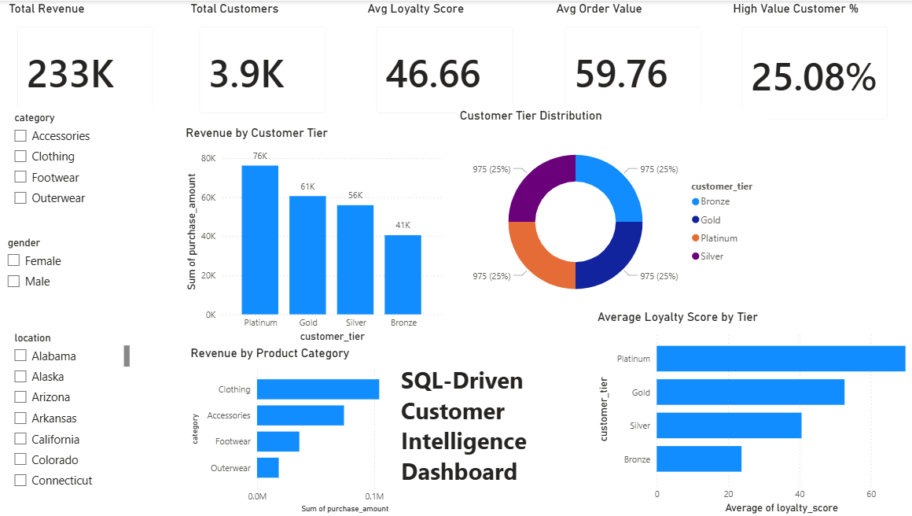

# SQL-Driven Customer Intelligence Dashboard

A complete end-to-end **Customer Analytics & Business Intelligence Project** built using **Python, SQL, and Power BI** to analyze customer behavior, loyalty patterns, discount dependency, and revenue contribution.

---

# 📌 Project Objective

The goal of this project is to answer a critical business question:

> **“Is the business successfully building a loyal customer base, or is it dependent on continuous promotional activity?”**

The project combines:
- Data Cleaning
- Feature Engineering
- SQL-Based Business Analysis
- Interactive Dashboarding
- Strategic Recommendation Generation

to transform raw customer data into actionable business intelligence.

---

# 🛠️ Tech Stack

- **Python**
  - Pandas
  - NumPy
  - Matplotlib
  - Seaborn

- **SQL**
  - MySQL

- **Visualization**
  - Power BI

---

# ❓ Key Business Questions Addressed

1. Who are the genuinely loyal customers vs discount-dependent customers?

2. What customer behaviors predict high long-term value?

3. Which locations and product categories are underperforming?

4. How should the business restructure promotional strategies?

5. What does the ideal customer profile look like?

---

# 📂 Dataset Overview

The dataset contains:
- Customer demographics
- Purchase amount
- Product category
- Subscription status
- Discount usage
- Previous purchases
- Payment methods
- Product details
- Review ratings
- Location data

### Total Records:
`3900 customers`

---

# 🔄 Project Workflow

```text
Raw Dataset
     ↓
Data Cleaning & Preprocessing
     ↓
Exploratory Data Analysis
     ↓
Feature Engineering
     ↓
SQL Business Intelligence Queries
     ↓
Power BI Dashboard
     ↓
Strategic Recommendations
```

---

# ⚙️ Feature Engineering

The following business-focused features were created:

## 1. Loyalty Score
Weighted score using:
- Previous purchases
- Purchase amount
- Subscription status
- Discount dependency

### Purpose
To identify genuinely engaged customers instead of relying only on purchase value.

---

## 2. Customer Tier Segmentation
Customers segmented into:
- Bronze
- Silver
- Gold
- Platinum

### Purpose
To enable customer targeting and retention strategies.

---

## 3. High Value Customer Flag
Identifies customers with:
- High loyalty
- Strong repeat behavior
- High annual contribution

### Purpose
To identify customers contributing maximum long-term business value.

---

## 4. Estimated Annual Value
Calculated using:
- Purchase amount
- Purchase frequency

### Purpose
To estimate long-term profitability.

---

# 🧠 SQL Analysis Performed

The project includes multiple SQL-based business intelligence queries such as:

- Customer Tier Distribution
- Revenue by Customer Tier
- Discount Dependency Analysis
- Promo Code Analysis
- Subscription Analysis
- High Value Customer Analysis
- Category Performance
- Location-Based Revenue Analysis
- Executive KPI Analysis

---

# 📈 Key Insights

## Customer Loyalty
- Platinum customers demonstrated the highest loyalty and spending behavior.
- Gold customers also contributed strong repeat purchases.

## Discount Dependency
- Non-discount customers generated higher overall revenue.
- Discounts did not significantly improve long-term loyalty.

## Product Categories
- Clothing generated the highest revenue contribution.
- Outerwear showed the weakest performance.

## High Value Customers
Only ~25% of customers qualified as high-value customers, but contributed significantly higher business value.

---

# 📊 Power BI Dashboard Features

The interactive dashboard includes:

- KPI Cards
- Revenue Analysis
- Customer Tier Distribution
- Loyalty Score Analysis
- Product Category Performance
- Interactive Filters
- Customer Segmentation Insights

---

# 🖼️ Dashboard Preview

_Add Power BI dashboard screenshot here_

Example:

```markdown

```

---

# 📌 Strategic Recommendations

## Promo Sunset Playbook

### 1. Reduce Blanket Discount Campaigns
Avoid excessive promotional dependency.

### 2. Introduce Personalized Promotions
Target customers based on:
- loyalty score
- customer tier
- purchase behavior

### 3. Prioritize Premium Customer Retention
Focus on:
- Platinum customers
- Gold customers
- Subscription users

### 4. Strengthen Subscription Programs
Improve:
- loyalty rewards
- member benefits
- exclusive access programs

---

# 🎯 Ideal Customer Profile (ICP)

The ideal customer identified through analysis is:

- Platinum-tier customer
- Loyalty score > 60
- Frequent repeat purchases
- High annual spending
- Low discount dependency
- Strong subscription engagement

---

# ✅ Final Business Conclusion

The analysis indicates that:

> The business is **not heavily dependent on promotional discounts** for customer retention.

Instead, long-term customer value is driven more by:
- repeat purchase behavior
- loyalty engagement
- subscription participation

than aggressive discounting.

---

# 📦 Deliverables

- Cleaned analytical dataset
- Feature engineered dataset
- SQL business intelligence queries
- Interactive Power BI dashboard
- Customer segmentation framework
- Strategic business recommendations
- Customer intelligence report

---

# 🚀 Future Scope

Possible future improvements:
- Predictive churn analysis
- Customer lifetime value prediction
- AI-driven recommendation systems
- Real-time analytics dashboard
- Personalized marketing automation

---
